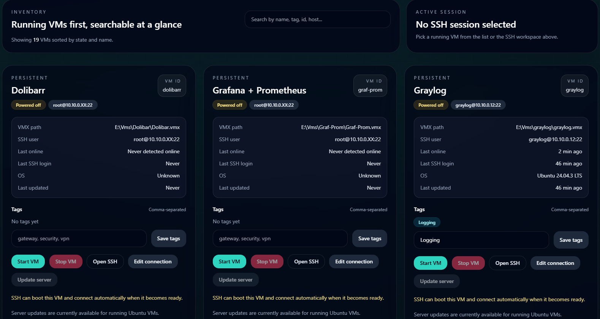
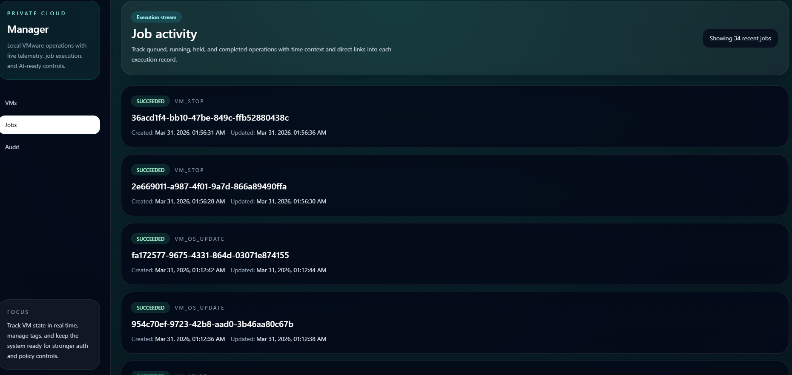
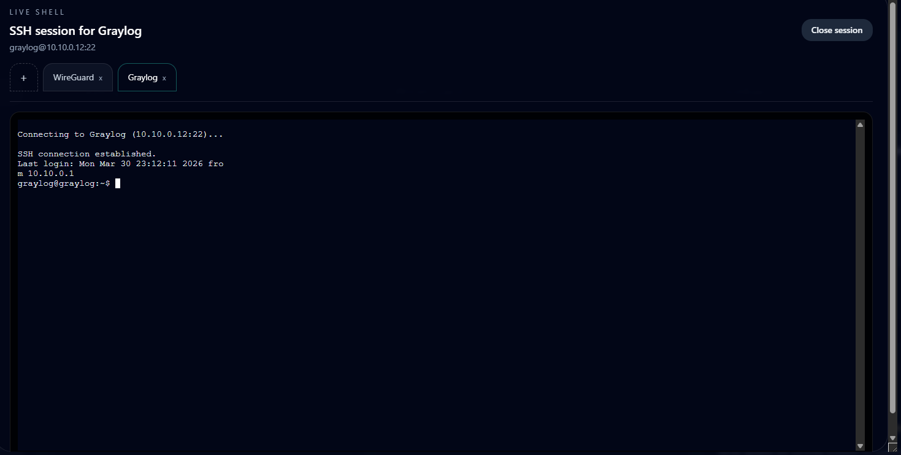
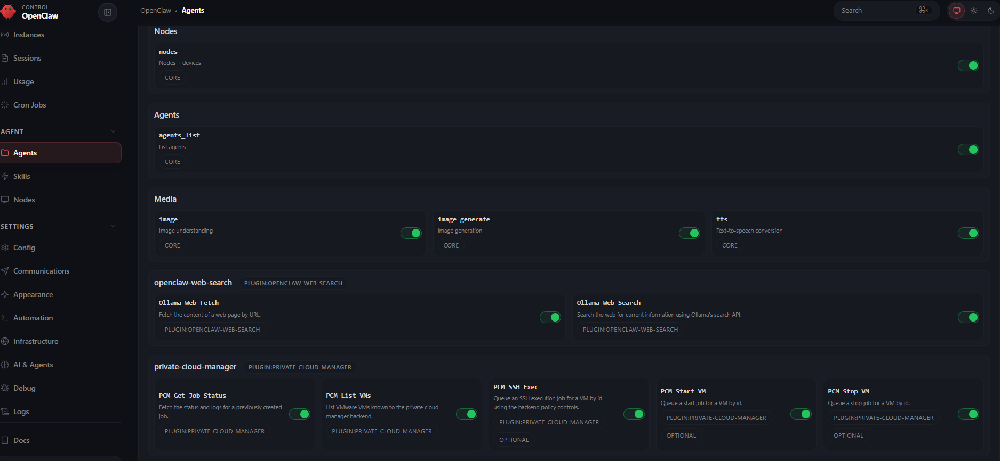

# Private Cloud Manager


Private Cloud Manager is a local-first VM control plane for VMware Workstation Pro. It turns a workstation-based private cloud into a real operator platform with inventory, APIs, jobs, audit logs, browser SSH, and an AI tool layer through OpenClaw.

It combines:

- a React frontend for inventory, jobs, audit, authentication, and browser-based SSH
- an Express backend for orchestration, VMware control, VM activity tracking, and audit logging
- an OpenClaw plugin so a local Ollama-powered assistant can operate the platform through structured tools

## Highlights

- Live VM power state in the dashboard
- Per-VM `last online` and `last SSH login` activity indicators
- Ubuntu-aware server update action with OS version, `last updated`, and reboot-required visibility
- Automatic OS metadata refresh on interactive SSH connect
- Job-based start and stop orchestration with logs and timestamps
- Audit view for operator actions and API activity
- Token-gated web interface
- Editable SSH connection details from the dashboard
- Multi-tab browser SSH workspace with same-VM parallel tabs
- Auto boot-and-connect flow for powered-off VMs
- OpenClaw integration on top of the same backend used by the UI

## Why I Built It

Once a local lab grows past a few VMs, operating everything through the VMware GUI, one-off shell commands, and scattered notes becomes noisy and fragile. I wanted the same qualities we expect from internal platform tooling, but applied to a local VMware environment:

- centralized inventory
- consistent APIs
- observable jobs
- browser-based access
- auditability
- AI-assisted operations without direct shell trust

## Screenshots

Add screenshots to `docs/screenshots/` and update the image paths below.

### VM Inventory



### Jobs View



### Browser SSH Workspace



### OpenClaw Tool Use



## Architecture

### `frontend/`

React + Vite + TypeScript + React Query + Tailwind CSS + `xterm`

Responsibilities:

- display VM inventory and live power state
- expose token-gated access to the operator UI
- show jobs, logs, and audit activity
- let operators update SSH connection details
- trigger managed Ubuntu server updates
- refresh OS family, version, and reboot-needed state on SSH connect
- provide a multi-session browser SSH workspace

### `backend/`

Express + TypeScript + Prisma + SQLite + `ssh2` + `ws`

Responsibilities:

- load and persist VM inventory
- expose VM, job, audit, and readiness APIs
- execute VMware operations through `vmrun`
- run managed Ubuntu package update jobs
- refresh remote OS metadata on successful interactive SSH login
- process background job handlers
- expose interactive SSH sessions over WebSocket
- record audit events and VM activity timestamps

### `openclaw-plugin-private-cloud-manager/`

OpenClaw plugin that exposes the backend as tools:

- `pcm_list_vms`
- `pcm_start_vm`
- `pcm_stop_vm`
- `pcm_ssh_exec`
- `pcm_get_job_status`
- `pcm_update_vm`

This lets a local OpenClaw assistant running on top of Ollama interact with the same backend APIs used by the frontend.

## How Prisma and the Database Work

Prisma is the ORM layer that defines and accesses the local SQLite database used by the backend.

The project uses a local SQLite file:

```text
backend/dev.db
```

The main records are:

- `VM`: normalized VM inventory plus live operational metadata
- `Job`: queued, running, failed, and completed operations
- `JobLog`: execution logs for each job
- `AuditEvent`: traceable operator and API actions

The inventory file is not the database. The flow is:

1. you define VMs in `backend/src/data/inventory.json`
2. the backend reads that file on startup
3. `inventory.service.ts` upserts those records into the `VM` table
4. the frontend and OpenClaw plugin operate on the database-backed records

So `inventory.json` is the bootstrap source, while Prisma + SQLite represent the live operational state.

## Inventory File and Public Example

The real inventory file can contain confidential information such as:

- internal IP addresses
- VM paths
- SSH usernames
- SSH passwords
- SSH private key paths

Because of that, the real file stays local and out of Git:

```text
backend/src/data/inventory.json
```

The committed template for other builders is:

```text
backend/src/data/inventory.example.json
```

To create your own inventory:

1. Copy `inventory.example.json` to `inventory.json`
2. Replace the example VM ids, names, and `.vmx` paths
3. Add either `password` or `privateKeyPath` for SSH-enabled VMs
4. Optionally add OS hints such as Ubuntu family/version so update actions are available immediately
5. Keep `inventory.json` private and untracked

## Project Structure

```text
.
├─ frontend/
├─ backend/
├─ openclaw-plugin-private-cloud-manager/
└─ docs/
```

## Local Setup

### Prerequisites

- Node.js installed
- VMware Workstation Pro installed on the host machine
- `vmrun.exe` available at the path expected by the backend
- one or more VMs configured in the backend inventory
- Ollama installed locally if you want the AI integration
- OpenClaw installed locally if you want the AI tool workflow
- SSH enabled on guest VMs you want to access or update through the dashboard

### Backend

```bash
cd backend
npm install
npx prisma generate
npx prisma db push
npm run dev
```

Default backend URL:

```text
http://127.0.0.1:8000
```

Important backend notes:

- API auth uses a bearer token
- if `API_TOKEN` is not set, the default fallback is `dev-token`
- the backend tracks VM state, SSH readiness, jobs, and audit activity
- Ubuntu VMs can be updated through a managed job instead of ad hoc SSH commands
- interactive SSH logins refresh `lastSshLoginAt`, OS family, OS version, and reboot-required state

### Frontend

```bash
cd frontend
npm install
npm run dev
```

Default frontend URL:

```text
http://127.0.0.1:5173
```

The frontend asks for the backend token at login and stores it in the browser for the current operator session.

### Ollama

Install and start Ollama locally, then pull at least one model that behaves reasonably with tools.

Example:

```powershell
ollama serve
ollama pull qwen2.5:7b-instruct-q4_K_M
```

Default Ollama URL used by OpenClaw:

```text
http://127.0.0.1:11434
```

Models can vary a lot in tool-following quality. In practice, smaller models may still invent recap text around correct tool calls, so test and compare.

### OpenClaw

Install OpenClaw locally and point it at your local Ollama instance.

Core pieces to configure:

1. Model provider:

```json
{
  "models": {
    "providers": {
      "ollama": {
        "baseUrl": "http://127.0.0.1:11434",
        "api": "ollama"
      }
    }
  }
}
```

2. Workspace:

```json
{
  "agents": {
    "defaults": {
      "workspace": "C:\\Users\\<you>\\.openclaw\\workspace"
    }
  }
}
```

3. Plugin loading and allowlist:

```json
{
  "plugins": {
    "allow": [
      "private-cloud-manager"
    ],
    "load": {
      "paths": [
        "D:\\Projects\\private-cloud-manager\\openclaw-plugin-private-cloud-manager"
      ]
    }
  }
}
```

### OpenClaw Plugin

Install the local plugin:

```powershell
openclaw plugins install -l D:\Projects\private-cloud-manager\openclaw-plugin-private-cloud-manager
```

Example plugin config:

```json
{
  "baseUrl": "http://127.0.0.1:8000/api",
  "token": "dev-token",
  "timeoutMs": 15000
}
```

Add the PCM tools to the OpenClaw agent allowlist:

```json
[
  "pcm_list_vms",
  "pcm_start_vm",
  "pcm_stop_vm",
  "pcm_ssh_exec",
  "pcm_get_job_status",
  "pcm_update_vm"
]
```

After changing plugin code, reinstall it from the local folder and restart OpenClaw:

```powershell
openclaw plugins install -l D:\Projects\private-cloud-manager\openclaw-plugin-private-cloud-manager
```

Recommended local OpenClaw workspace files:

- `USER.md` with who the operator is and what they care about
- `IDENTITY.md` for the assistant persona
- `TOOLS.md` with environment-specific tool-grounding rules

These files do not make the tools work, but they improve consistency and reduce unhelpful narration.

## End-to-End Setup Flow

1. Configure `backend/src/data/inventory.json` from `inventory.example.json`
2. Start the backend and let Prisma create/sync the SQLite database
3. Start the frontend and verify you can log in with the backend token
4. Verify VM listing, power-state refresh, and SSH access from the browser UI
5. Start Ollama and pull a model
6. Install and configure OpenClaw
7. Install the local PCM plugin, allow the PCM tools, and restart OpenClaw
8. Test with `pcm_list_vms`, then `pcm_start_vm`, then `pcm_get_job_status`

## Example OpenClaw Prompts

- `Use pcm_list_vms to list my VMs. Do not use exec.`
- `Use pcm_stop_vm with vmId "wireguard". Do not use exec.`
- `Use pcm_get_job_status with a job id returned by the backend.`
- `Use pcm_update_vm with vmId "ubuntu-web". Do not use exec.`

## Design Choices

One of the strongest decisions in this project is that the AI layer does not directly control the host. Instead:

- the assistant uses explicit tools
- those tools call the backend API
- the backend remains the single execution layer

That keeps policy, logging, and operational behavior centralized for both human and AI operators.

## Community

This project is not just for my own environment. I want it to be understandable, reusable, and useful to other people building local labs, private-cloud tooling, and AI-assisted operations workflows.

That is why the public repo includes:

- a real project writeup
- a safe inventory example instead of leaking private infrastructure details
- architecture documentation across frontend, backend, and OpenClaw integration
- a structure that other builders can adapt to their own VMware environments

The goal is to contribute something practical to the community: a concrete example of how local infrastructure, platform engineering, and local AI tooling can work together in a clean and controlled way.

## Documentation

- [Project writeup](./docs/PROJECT_WRITEUP.md)
- [Frontend notes](./frontend/README.md)
- [Backend notes](./backend/README.md)
- [OpenClaw plugin notes](./openclaw-plugin-private-cloud-manager/README.md)

## Roadmap

- transitional VM states such as `booting` and `stopping`
- snapshot lifecycle support
- richer SSH readiness and connection diagnostics
- authentication and access management beyond a single token
- stronger SSH policy controls
- approval flows for sensitive actions
- multi-host support
- more OpenClaw tools and operational workflows
